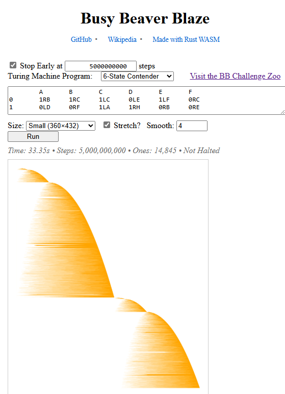

# Busy Beaver Blaze

**A Turing-machine interpreter and space-time visualizer, implemented in Rust and compiled to native & WebAssembly**

* [Run this program in your own web browser](https://carlkcarlk.github.io/busy_beaver_blaze/).
* Watch [an animation](https://youtu.be/IBcJ2vRHGAY) made with this program.

## Features

* Within the program, run the champion [Busy Beaver](https://en.wikipedia.org/wiki/Busy_beaver) Turing machines for millions of steps in less than a second.
* Run your own Turing machines.
* Visualize Turing machines with space time diagrams.
* Watch the space time diagrams develop as the Turing machine runs.
* Speed and step::
 -- Visualize millions of steps in less than a second.
 -- Visualize a billion steps in about 5 seconds.
 -- Visualize 50 billion steps in about 10 minutes.
* Understands common formats for Turing machines ("Symbol Major", "State Major", and ["standard format"](https://discuss.bbchallenge.org/t/standard-tm-text-format/60).)

## Techniques

* The Turing machine interpreter is a straight forward implementation in Rust.
* The space-time visualization is implemented via adaptive sampling. The sampler starts by recording the whole tape at every machine step. Whenever the tape or steps grows beyond twice the size of the desired image, the sampler reduces the sampling rate by half. Total memory and time used is, thus, proportional to the size of the desired image, not the number of machine steps or width of visited tape.
* Tips on porting Rust to WASM: [Nine Rules for Running Rust in the Browser](https://medium.com/towards-data-science/nine-rules-for-running-rust-in-the-browser-8228353649d1) in *Towards Data Science*.

## Web App Screenshot



A space-time diagram for the best known 6-state busy beaver after running for exactly 10 billion steps. Each vertical slice shows the Turing machine tape at one point in time, with dark pixels representing 1s and light pixels representing 0s. Time flows down.

## Video

* [Turing Machine "BB6 Contender": 1 Trillion Steps with Exponential Acceleration (YouTube)](https://youtu.be/IBcJ2vRHGAY)
* To render a video, edit `examples/movie.rs` to set the output directory, font, etc.. Then:

```bash
cargo run --example movie --release
```

## Related Work

* [The Busy Beaver Challenge](bbchallenge.org)
* [Quanta Magazine article](https://www.quantamagazine.org/amateur-mathematicians-find-fifth-busy-beaver-turing-machine-20240702/) and ["Up and Atom" video](https://www.youtube.com/watch?v=pQWFSj1CXeg&t=977s) on recent progress.

* Fiery created a very nice, fast [full-featured visualizer](https://fiery.pages.dev/turing/1RB1LC_0RD0RB_1RA0LC_1LD1RA) with TypeScript. It powers the diagrams of the [Busy Beaver Challenge](https://bbchallenge.org/). It seems to be limited to about 4 billion steps. It displays the diagram all at once rather than showing the diagram's development.

* If you want to run a Turing machine beyond trillions of steps, look at this thread on [math.stackexchange.com](https://math.stackexchange.com/questions/1202334/how-was-the-busy-beaver-candidate-for-6-states-calculated).

## License

This project is dual-licensed under either:

* MIT License ([LICENSE-MIT](LICENSE-MIT) or <https://opensource.org/licenses/MIT>)
* Apache License, Version 2.0 ([LICENSE-APACHE](LICENSE-APACHE) or <https://www.apache.org/licenses/LICENSE-2.0>)

at your option.

## Contributing

Contributing to this project is welcome. Feature and bug reports are appreciated.
